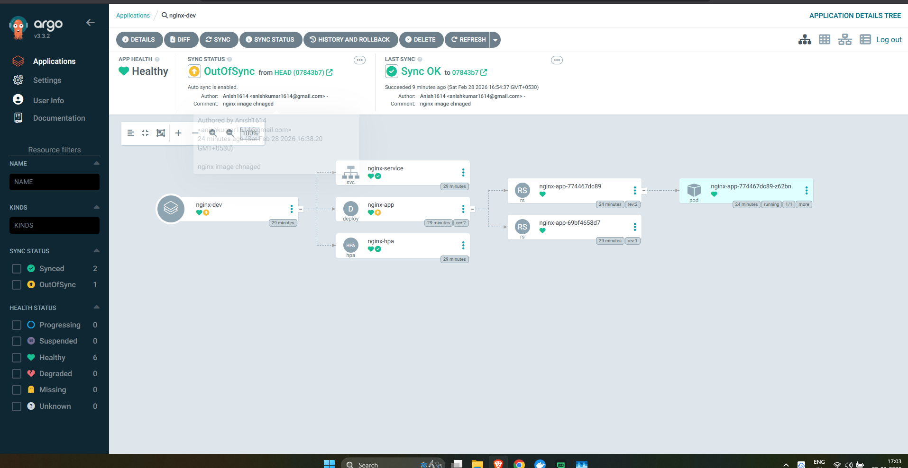
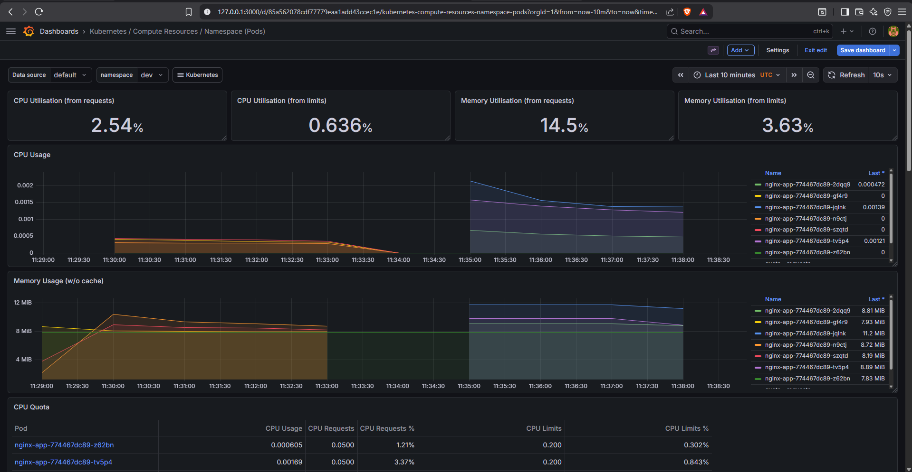
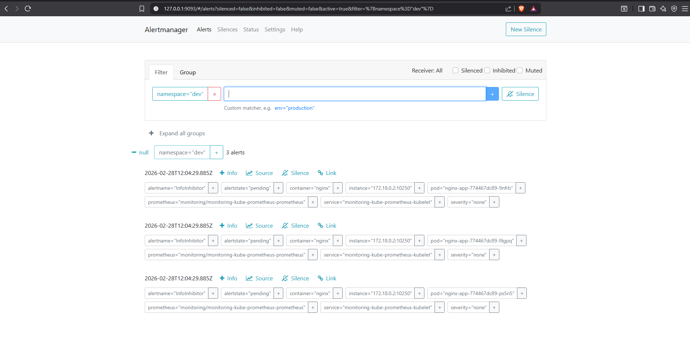
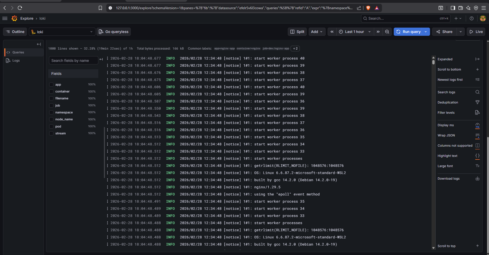

# 🚀 Production-Style Kubernetes Platform (Local Environment)

[](https://kubernetes.io/)
[](https://argoproj.github.io/argo-cd/)
[](https://prometheus.io/)
[](https://grafana.com/)

A production-inspired Kubernetes platform built locally using **Kind**, implementing GitOps, autoscaling, monitoring, alerting, and centralized logging. This project simulates a real-world EKS-grade platform architecture in a local environment before cloud migration.

---

## 📌 Table of Contents
- [Objective](#-objective)
- [Architecture Overview](#-architecture-overview)
- [Repository Structure](#-repository-structure)
- [Local Environment Setup](#-local-environment-setup)
- [Horizontal Pod Autoscaling (HPA)](#-horizontal-pod-autoscaling-hpa)
- [Monitoring & Alerting](#-monitoring--alerting)
- [Centralized Logging](#-centralized-logging)
- [Incident Simulation](#-incident-simulation)
- [Key Learnings](#-key-learnings)

---

## 🎯 Objective
Design and operate a GitOps-driven, observable, auto-scaling Kubernetes platform with:
- **Declarative deployments** via Argo CD.
- **Horizontal Pod Autoscaling (HPA)** for dynamic workloads.
- **Real-time monitoring** with Prometheus & Grafana.
- **Custom alerting** for incident response.
- **Centralized logging** with Loki + Promtail.
- **Failure simulation** for platform resilience.

---

## 🏗️ Architecture Overview

### Core Components
| Layer | Technology | Description |
| :--- | :--- | :--- |
| **Cluster** | Kind | Kubernetes in Docker for local development |
| **GitOps** | Argo CD | Declarative state management and self-healing |
| **Metrics** | Prometheus | Time-series database for cluster metrics |
| **Visualization** | Grafana | Dashboarding for visibility |
| **Alerting** | Alertmanager | Alert routing and notification |
| **Logging** | Loki + Promtail | Log aggregation and querying |
| **Scaling** | HPA | Resource-based pod autoscaling |

---

## 📂 Repository Structure
```text
eks-gitops-platform/
│
├── kubernetes/
│   ├── apps/
│   │   └── nginx/
│   │       ├── deployment.yaml
│   │       ├── service.yaml
│   │       ├── hpa.yaml
│   │       └── kustomization.yaml
│   │
│   └── monitoring/
│       └── high-cpu-alert.yaml
│
├── argocd/
│   └── applications/
│       └── nginx-dev.yaml
│
└── README.md
```

---

## ⚙️ Local Environment Setup

### 1️⃣ Create Kind Cluster
```bash
kind create cluster --name prod-platform
```

### 2️⃣ Create Namespaces
```bash
kubectl create namespace dev
kubectl create namespace prod
kubectl create namespace monitoring
kubectl create namespace argocd
```

### 3️⃣ Install Argo CD (GitOps Engine)
```bash
helm repo add argo https://argoproj.github.io/argo-helm
helm repo update
helm install argocd argo/argo-cd -n argocd --create-namespace
```

**Access Argo CD UI:**
```bash
kubectl port-forward svc/argocd-server -n argocd 8080:443
```
- **URL**: `https://localhost:8080`

### 4️⃣ Deploy Application via GitOps
- NGINX deployment managed entirely via Git.
- Argo CD auto-sync and self-healing enabled.
- No manual `kubectl apply` for workloads.

---

## 📈 Horizontal Pod Autoscaling (HPA)

### Metrics Server Setup
Kind requires a specific patch for the metrics-server to work locally:
```bash
kubectl patch deployment metrics-server -n kube-system --type='json' -p='[{"op": "add", "path": "/spec/template/spec/containers/0/args/-", "value": "--kubelet-insecure-tls"}]'
```

### HPA Configuration
- **Min Replicas**: 2
- **Max Replicas**: 6
- **Target CPU**: 50%

### Load Simulation
```bash
kubectl run -i --tty load-generator --rm --image=busybox -n dev -- /bin/sh
# Inside the shell:
while true; do wget -q -O- http://nginx-service; done
```
**Observed scaling**: `2 → 3 → 4 → ...` replicas under sustained load.

---

## 📊 Monitoring & Alerting

### Installation
```bash
helm install monitoring prometheus-community/kube-prometheus-stack \
  --namespace monitoring \
  --create-namespace
```

### Alerting Rule
Custom `PrometheusRule` created for high CPU detection:
- **Alert Name**: `NginxHighCPU`
- **Condition**: CPU usage > threshold for 1 minute.
- **Visibility**: Observed firing in Alertmanager UI.

### Accessing Dashboards
| Tool | Command | URL |
| :--- | :--- | :--- |
| **Grafana** | `kubectl port-forward svc/monitoring-grafana -n monitoring 3000:80` | `http://localhost:3000` |
| **Alertmanager** | `kubectl port-forward svc/monitoring-kube-prometheus-alertmanager -n monitoring 9093:9093` | `http://localhost:9093` |

---

## 📜 Centralized Logging

### Loki Stack Installation
```bash
helm install loki grafana/loki-stack --namespace monitoring
```
Logs are available in **Grafana → Explore → Loki**.

**Example Query:**
```logql
{namespace="dev"}
```

---

## 🧪 Incident Simulation

### Scenarios Performed:
1.  **CPU Stress Test**: Triggered HPA to validate autoscaling.
2.  **HPA Validation**: Verified replica count adjustments in real-time.
3.  **Alert Triggering**: Validated that `NginxHighCPU` alert fires correctly in Alertmanager.
4.  **Restart Analysis**: Observed pod restart metrics and stability.

---

## 🖼️ Screenshots

### GitOps Management (Argo CD)


### Performance Monitoring (Grafana)


### Alert Notifications (Alertmanager)


### Log Aggregation (Loki)


---

## 💡 Key Learnings
- **GitOps Enforces Discipline**: Prevents configuration drift and ensures a single source of truth.
- **Metrics Reliability**: HPA is only as good as the `metrics-server` configuration.
- **Test Your Alerts**: Alerting rules must be empirically tested via simulation.
- **Full Visibility**: Production readiness requires the integration of metrics, logs, and alerts.

---
*Built with ❤️ for Platform Engineering*
