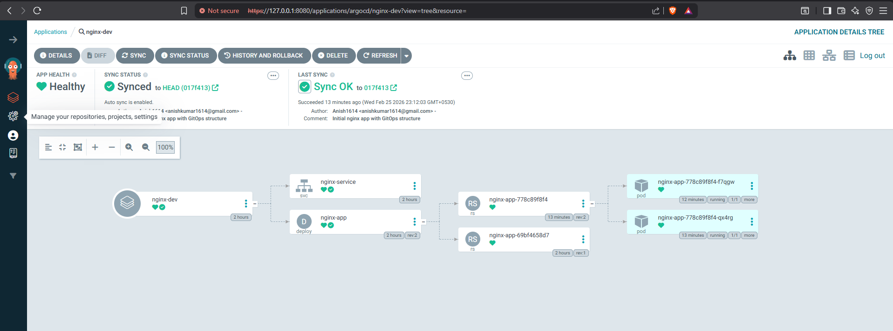

phase 3 
--- 
metric server
kubectl apply -f https://github.com/kubernetes-sigs/metrics-server/releases/latest/download/components.yaml
issue - Readiness probe failed: HTTP probe failed with statuscode: 500
fix:
kubectl patch deployment metrics-server -n kube-system --type='json' -p='[
  {
    "op": "add",
    "path": "/spec/template/spec/containers/0/args/-",
    "value": "--kubelet-insecure-tls"
  }
]'
kubectl rollout status deployment/metrics-server -n kube-system
kubectl get pods -n kube-system | grep metrics

